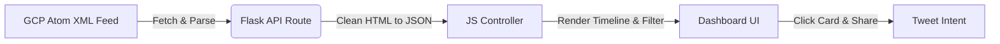

# BigQuery Release Notes Tracker & Tweet Composer

A modern, responsive web application built with **Python Flask** and **Vanilla HTML/CSS/JS** that fetches, organizes, and processes Google Cloud BigQuery release notes. It parses update items individually and includes a custom **Tweet Composer** that automates formatting and character limits for sharing updates to Twitter.

---

## 🚀 Features

*   **Live Feed Synchronization:** Automatically pulls the latest release updates from the Google Cloud BigQuery Atom feed.
*   **Granular Parser:** Splits complex daily summaries into isolated cards representing individual updates (e.g. Features, Changes, Issues, Announcements).
*   **Interactive Search & Filters:** Fast, client-side keyword search and filter chips to quickly find specific types of updates.
*   **Tweet Composer Modal:** Displays an overlay composer when selecting an update. It calculates remaining characters out of 280, automatically truncates descriptions to fit, and redirects to a Twitter Web Intent.
*   **Clipboard Copy Shortcut:** Copy the plain-text details of any single update card instantly, complete with animated visual checkmarks.
*   **CSV Exporter:** Compiles and downloads currently filtered/searched release notes into a formatted CSV sheet.
*   **Persistent Theme Switcher:** Features a dark/light mode toggle in the header that overrides CSS root variables dynamically and stores the user choice in `localStorage`.
*   **Mobile-First Design:** Optimized layouts, margins, icon buttons, and overlay modals specifically tailored to small smartphone screens.

---

## 📁 Directory Structure

```text
├── README.md                  # Project overview and instructions
├── .gitignore                 # Excluded environments and cache
├── bq-releases-notes/         # Main application directory
│   ├── app.py                 # Flask server & feed parsing engine
│   ├── templates/
│   │   └── index.html         # Frontend HTML structure
│   └── static/
│       ├── css/
│       │   └── style.css      # Custom dark/light mode stylesheet
│       └── js/
│           └── main.js        # Dynamic filtering, rendering, CSV exports, & theme toggles
```

---

## 🛠️ Setup & Installation

### Prerequisites
*   Python 3.7+
*   Flask (`pip install flask`)

### 1. Run Locally
Navigate to the application folder and start the Flask web server:

```bash
cd bq-releases-notes
python3 app.py
```

### 2. Access the Application
The server is configured to bind to `0.0.0.0` so it can accept requests on your local area network (LAN):
*   **From your Mac (Host):** Open your browser and go to [**http://127.0.0.1:5001**](http://127.0.0.1:5001) or [**http://localhost:5001**](http://localhost:5001).
*   **From your Mobile / LAN Devices:** Ensure your device is on the same Wi-Fi network and navigate to the Mac's IP address (e.g., `http://<your-mac-ip>:5001` or `http://10.0.0.133:5001`).

---

## 🔄 Architecture & Data Flow



1.  The client initiates an asynchronous request to `/api/releases`.
2.  The Flask server fetches the raw feed from GCP, parses elements using `xml.etree.ElementTree`, splits item blocks using custom regex, cleans tags, and returns JSON.
3.  The Javascript controller handles searching, category filtering, theme states, and CSV exports in-memory, updating card containers on the fly.
4.  Selecting a card opens the Tweet modal, where the character constraint engine handles safe formatting.
